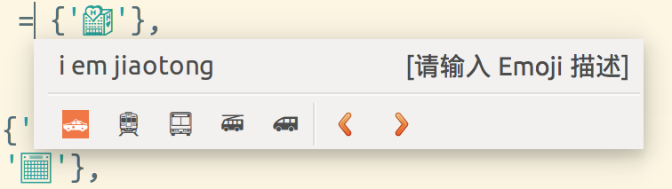
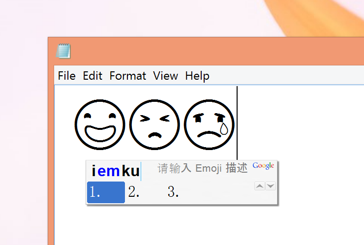

# Emoji 拼音输入法扩展

Emoji 拼音输入法扩展，可用于 [Google 拼音](http://www.google.com/intl/zh-CN/ime/pinyin/)、[ibus-libpinyin](https://github.com/epico/ibus-libpinyin) 和 [Fcitx](https://fcitx-im.org)。安装扩展后，输入 iem + 拼音（如 iemgaoxing）即可输入相应表情符号。

该项目可以使用 OS X 10.10 中的`/usr/share/mecabra/zh/common/emoji.plist`生成 Lua 扩展。

# 使用指南

## 生成扩展

扩展使用 OS X 中的 `/usr/share/mecabra/zh/common/emoji.plist` 作为 emoji 数据，所以你需要在 OS X 上生成扩展。

1. 安装 Python 3
2. `sudo pip3 install -r requirements.txt`
3. `python3 generator.py /usr/share/mecabra/zh/common/emoji.plist`
4. `emoji.lua` 会生成到当前目录

## 安装扩展

* ibus-libpinyin：将 emoji.lua 放到 ~/.config/ibus/libpinyin/user.lua 即可
* Google 拼音：直接在设置中添加扩展
